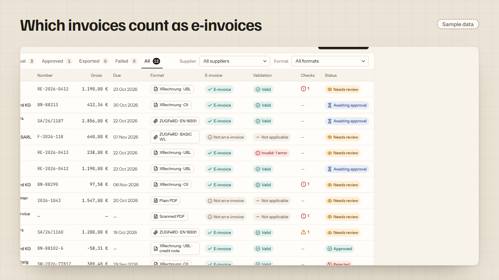
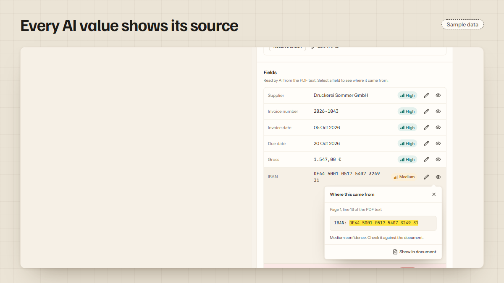
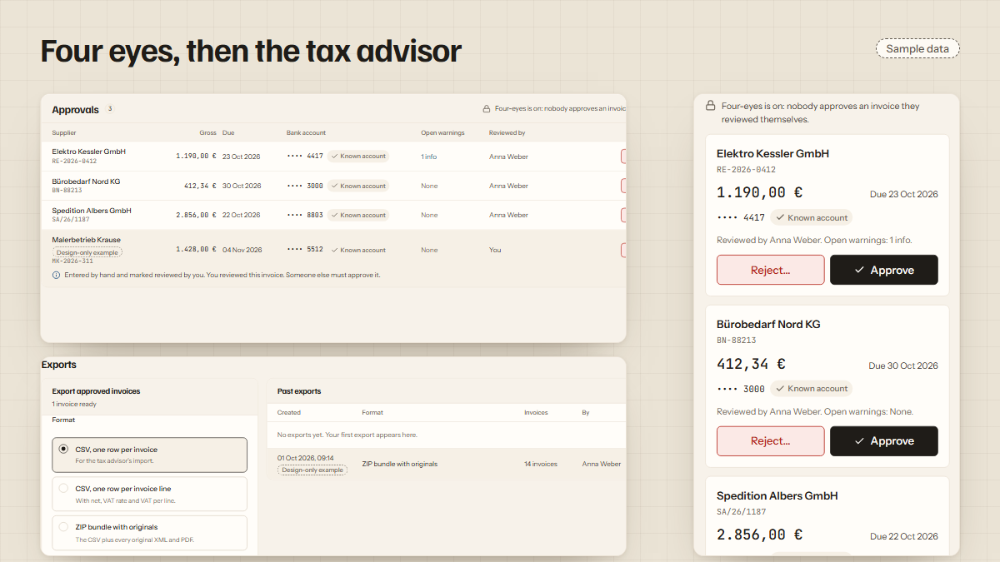
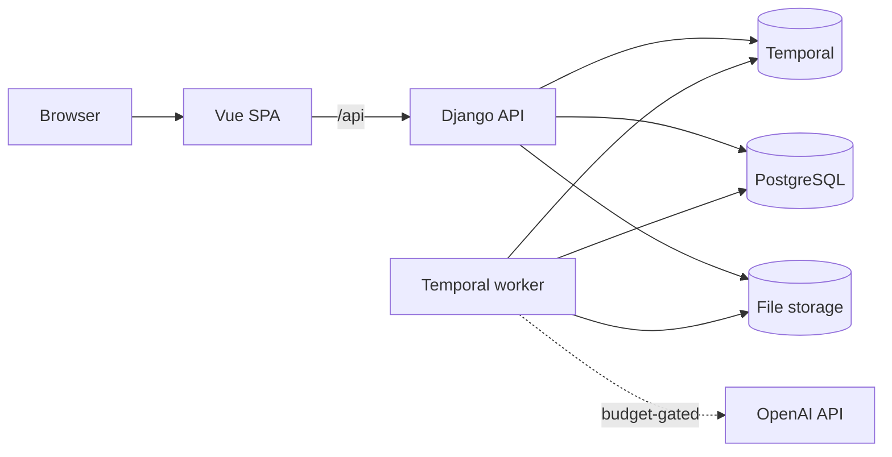

# Eingang

Eingang is an inbox for supplier invoices that tells a small German business whether each invoice is a valid e-invoice, turns every invoice (XRechnung XML, ZUGFeRD/Factur-X PDF or plain PDF) into the same clean data, catches duplicates and changed bank details, routes it for approval and exports it for the accountant.

**Live demo:** not deployed yet. The link is added when the project is deployed.

<p>
  
  
  
</p>

## The problem

Since 1 January 2025, every German business must be able to **receive** structured e-invoices that follow EN 16931. From 1 January 2027, businesses with more than €800,000 turnover may no longer **issue** paper or unstructured PDF invoices. From 1 January 2028 this applies to all domestic business-to-business invoices, except small-amount invoices up to €250 ([European Commission, "eInvoicing in Germany"](https://ec.europa.eu/digital-building-blocks/sites/spaces/DIGITAL/pages/467108886/eInvoicing+in+Germany)). Accepted formats include XRechnung (UBL or UN/CEFACT CII XML) and ZUGFeRD, a PDF with the invoice XML embedded; according to the BMF letter of 15 October 2024, the ZUGFeRD profiles MINIMUM and BASIC-WL do not count as e-invoices, and in a hybrid file the XML is the authoritative part ([ELO summary of the BMF letter](https://www.elo.com/de-de/blog/e-rechnungspflicht-bmf-schreiben-und-faq.html)). In a Bitkom survey of 1,103 German companies published in December 2024, only 45% could receive e-invoices ([vendor summary by Insiders Technologies](https://insiders-technologies.com/en/blog/e-invoicing-study-bitkom)). So for years a small company will receive a mix of valid XRechnung files, ZUGFeRD PDFs of varying quality, and plain PDFs. Someone has to check each one, type in the data, and notice when the same invoice arrives twice or a supplier's bank account suddenly changes, which is a common fraud pattern. Then the invoice needs approval and has to go to the tax advisor.

Eingang is not tax or legal advice. It checks published technical rules (EN 16931, XRechnung) and simple bookkeeping consistency.

## What it does

- Detects the format of each incoming file: XRechnung (UBL or CII), ZUGFeRD/Factur-X with its profile, plain PDF, or scan.
- Validates structured invoices against the official XSD and Schematron rules (KoSIT configuration `v2026-01-31`) and explains each finding in plain language.
- Turns every invoice into the same fields: from the XML where there is one, and from the PDF text with an AI model where there isn't, with the evidence and a confidence level for each value.
- Runs business checks C01–C16: duplicates, changed bank details, arithmetic, an invoice addressed to someone else, overdue invoices, and more.
- Routes invoices through review and four-eyes approval, and exports CSV/ZIP files for the tax advisor.

## How well it works

Full method and limits: [docs/EVALS.md](docs/EVALS.md).

- **Validation parity with the official KoSIT validator:** the same verdict on **100%** of 176 files, and the same set of failed rules on **100%** (64 files excluded as not applicable or without a KoSIT scenario).
- **Field extraction from PDF text**, on 104 ZUGFeRD corpus invoices (truth = the embedded XML): a label-based regex baseline gets the critical fields (number, date, gross total, IBAN) all right on **21.2%** of invoices (95% CI 13.5–28.8%). The AI extraction run is pending and will be added here.

## Architecture



The Vue app talks only to its own origin, which proxies `/api` to the Django API. The API stores uploads and starts one Temporal workflow per document. The worker does the heavy work: format detection, validation with SaxonC, PDF text extraction, and the budget-gated AI calls. It then waits durably for review and approval signals. See [docs/ARCHITECTURE.md](docs/ARCHITECTURE.md).

## Run it locally

Prerequisites: Docker with Compose v2, Node 24 with Corepack, and [uv](https://docs.astral.sh/uv/).

```sh
corepack enable
pnpm install
cd backend && uv sync --all-groups --all-extras && cp .env.example .env && cd ..
docker compose up -d --wait db temporal
cd backend && uv run python manage.py migrate && uv run poe ensure-schedules && cd ..
pnpm seed
pnpm dev
```

Open http://localhost:3110 and choose **Open the sandbox**, or sign in as `admin@example.invalid` with the password `eingang-dev` (the seed users; the password is `SEED_PASSWORD`). `pnpm dev` runs the API (http://localhost:8010), the worker and the web app; the Temporal UI is at http://localhost:8233. `pnpm verify` runs every check, and `pnpm test:e2e` runs the browser tests against the full Docker stack. The AI features stay off until `LLM_ENABLED=true` and an OpenAI key are set (see [docs/DEPLOY.md](docs/DEPLOY.md)).

## Costs

Measured idle use, prices and the AI spend so far: [docs/COSTS.md](docs/COSTS.md).

## Data and licences

- [ZUGFeRD corpus](https://github.com/ZUGFeRD/corpus) at commit `d891458e`: sample e-invoices used for parsing tests and the evaluation. Apache License 2.0. It is downloaded by `uv run poe fetch-corpus` into `data/corpus/` and never committed.
- KoSIT XRechnung validator configuration, visualisation and test suite (release `v2026-01-31`), vendored in `backend/vendor/`. Apache License 2.0; details in [NOTICE](NOTICE).
- Sandbox samples in `samples/`: twelve fictional invoices generated by `uv run poe build-samples`. They are this project's own work, MIT.
- Design export in `design/export/`: the owner's own work, MIT.
- Third-party artefacts are listed with their licences in [NOTICE](NOTICE).

## Verified vs assumed

Statements that were not verified against a real system are listed in [docs/ASSUMPTIONS.md](docs/ASSUMPTIONS.md).

## Roadmap

- DATEV EXTF "Buchungsstapel" export, following DATEV's official specification.
- OCR for scanned invoices, with a local engine so documents never leave the server.
- PDF/A-3 conformance checking with veraPDF.
- Profile-specific Factur-X Schematron for BASIC and EXTENDED.
- Peppol receiving through an access point.
- Email forwarding address per organisation instead of IMAP polling.
- Highlight the evidence for each extracted field directly on the rendered PDF.

## License

MIT. See [LICENSE](LICENSE).
