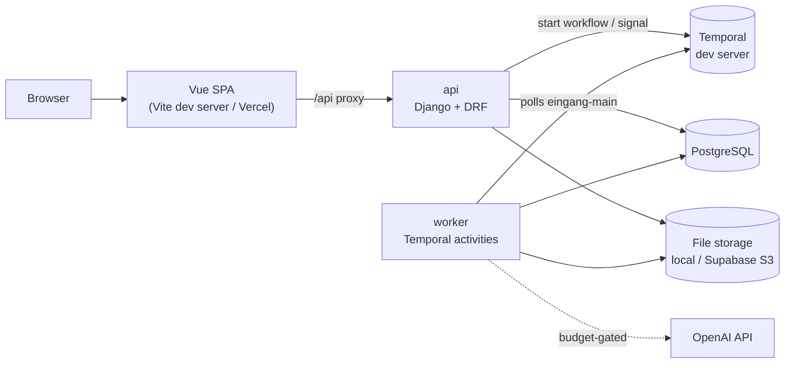

# Architecture

This file grows with each milestone. It covers the component map, the request flow, the workflow diagrams, and where each rule of the specification is implemented.

## Component map

| Component | Code | Runs as |
|-----------|------|---------|
| `einvoice` | `backend/src/einvoice/` | Library with no framework imports, used by the worker and the tools |
| API | `backend/src/eingang/` (project) plus Django apps | `manage.py runserver` (development), gunicorn (production) |
| Worker | `backend/src/eingang/worker.py` | `python -m eingang.worker` |
| Workflows | `backend/src/eingang/workflows/` | Inside the worker; imports only the standard library, `temporalio` and the contracts module |
| Frontend | `frontend/` | Vite dev server on 3110; static build on Vercel |
| Backing services | `compose.yaml` | Docker: `db` (PostgreSQL 17, port 5452), `temporal` (gRPC 7233, UI 8233) |

## Request flow (API)

1. `eingang.middleware.RequestContextMiddleware` takes the request id from `x-request-id`, or generates a UUID v7. It stores the id in a context variable that every log line reads, and echoes it in the response.
2. Django's security, session, CSRF and authentication middleware run.
3. The DRF view runs. Any error goes through `eingang.problem.exception_handler` and becomes `application/problem+json`.
4. Unknown routes (404) and unhandled exceptions (500) are turned into problem+json by the same middleware. No internal detail reaches the client.
5. The middleware writes one log line: method, path without the query string, status, duration, request id.

## Where the rules live

| Rule (HANDOFF.md) | Implemented in |
|-------------------|----------------|
| Configuration read once, invalid configuration exits with status 1 | `backend/src/eingang/config.py` |
| Errors are problem+json with documented codes | `backend/src/eingang/problem.py`, `docs/ERRORS.md` |
| Request id, request log line without query string | `backend/src/eingang/middleware.py`, `backend/src/eingang/log.py` |
| `/healthz`, `/readyz` (database and Temporal, 2-second timeouts) | `backend/src/eingang/health.py`, `backend/src/eingang/temporal_client.py` |
| Security headers | `backend/src/eingang/settings.py` |
| OpenAPI at `/api/schema/` and `/docs`, committed `openapi.json` | `backend/src/eingang/urls.py`, `backend/tools/export_openapi.py` |
| Import boundaries | `backend/.importlinter` |
