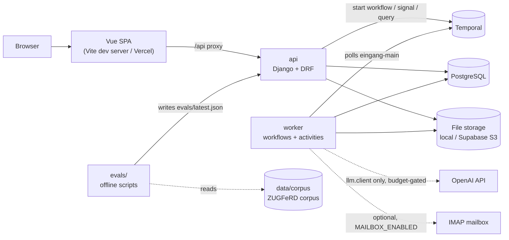
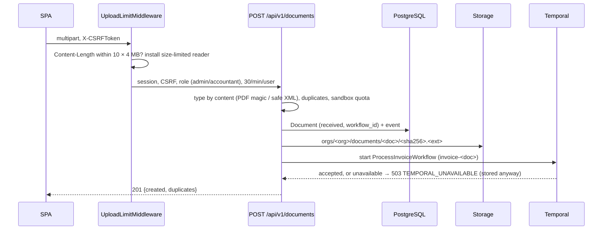
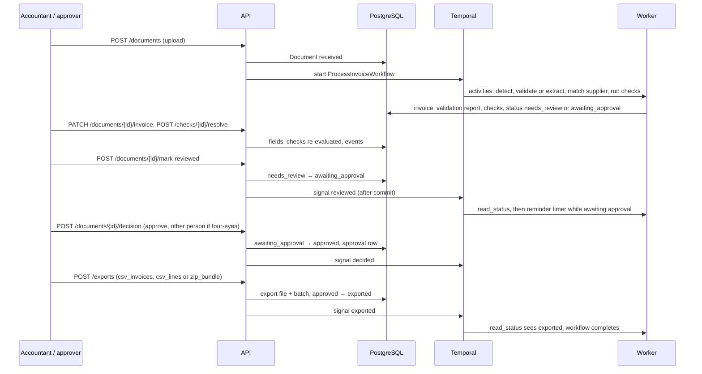
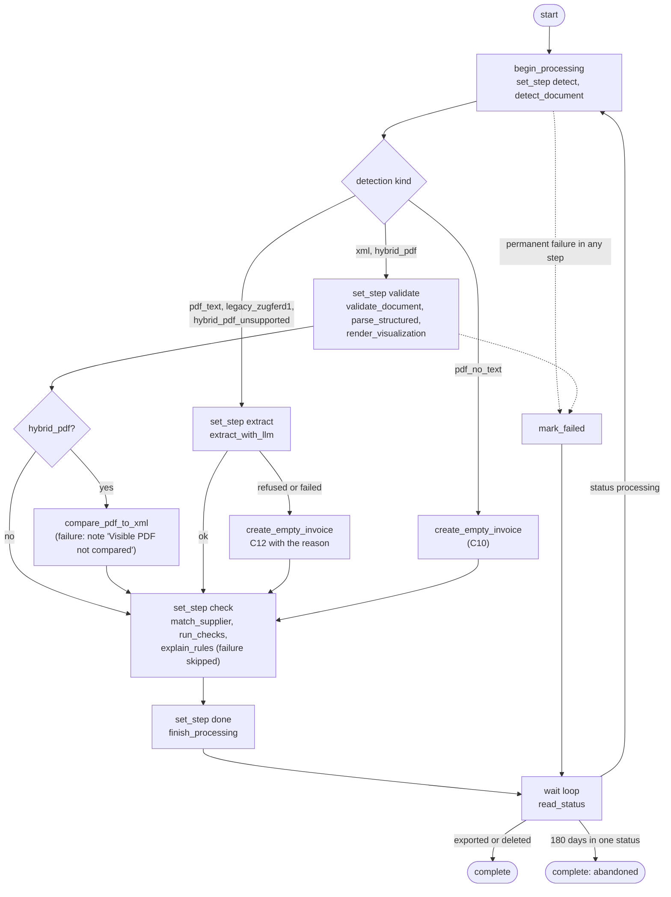
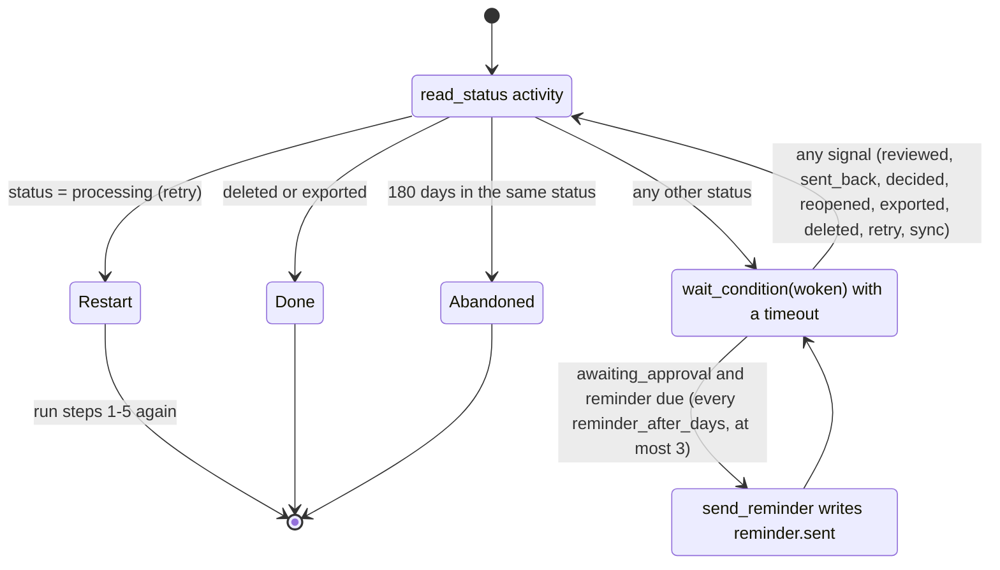
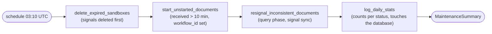
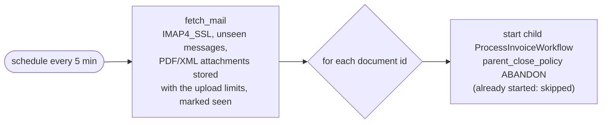
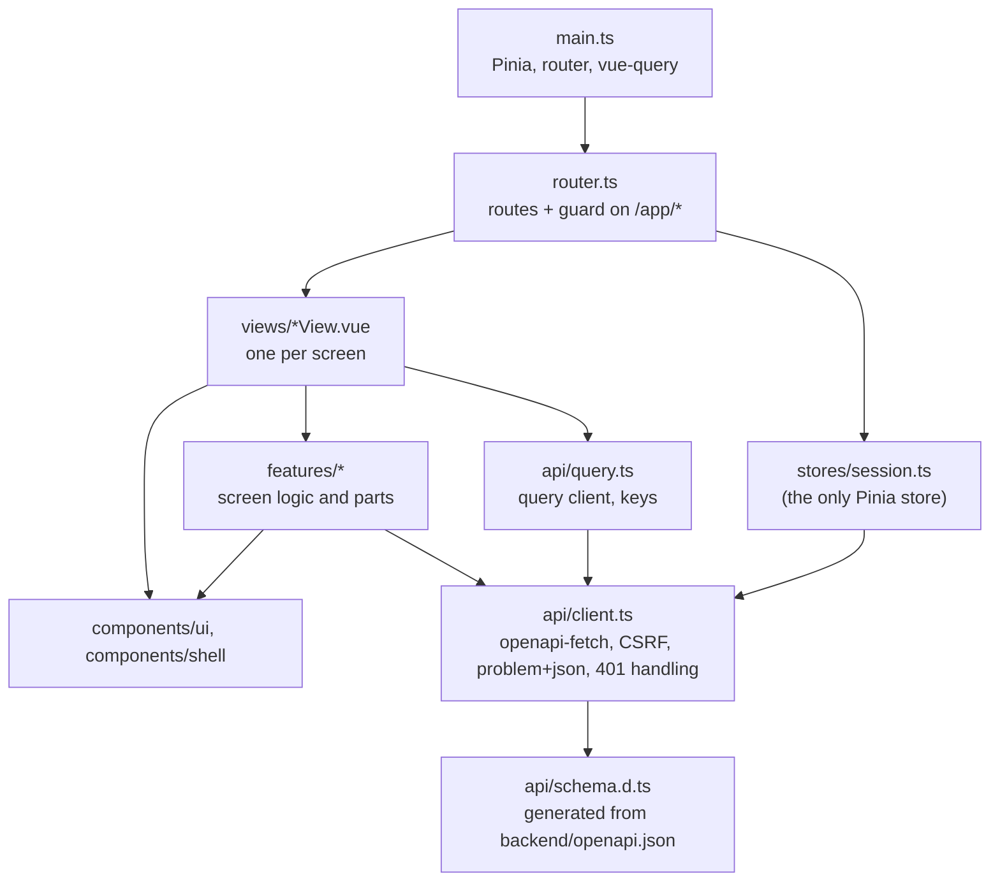
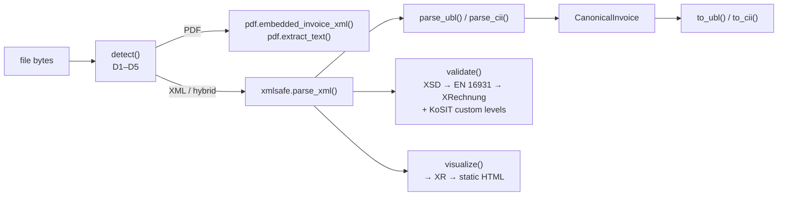

# Architecture

This file describes how Eingang is put together: the component map, the request flows, the Temporal workflows, the LLM layer, the evaluation, the frontend, and where each rule of the specification is implemented.

## Component map

| Component | Code | Runs as |
|-----------|------|---------|
| `einvoice` | `backend/src/einvoice/` | Library with no framework imports (detection, parsing, validation, visualisation, writing), used by the worker, the tools and the evaluation |
| API | `backend/src/eingang/` (project) plus the Django apps `accounts`, `invoices`, `suppliers`, `exports`, `llm`, `sandbox` | `manage.py runserver` (development), gunicorn (`backend/docker/api.Dockerfile`) |
| Worker | `backend/src/eingang/worker.py` | `python -m eingang.worker` (`backend/docker/worker.Dockerfile`); one task queue `eingang-main`, at most 4 concurrent activities on a thread pool |
| Workflows | `backend/src/eingang/workflows/` | Inside the worker; imports only the standard library, `temporalio` and `contracts.py` |
| Activities | `backend/src/invoices/activities.py`, `backend/src/eingang/maintenance_activities.py`, `backend/src/eingang/mailbox_activities.py` | Inside the worker, after `django.setup()` |
| Schedules | `backend/src/eingang/schedules.py`, command `ensure_schedules` | Run in the API pre-deploy command, the e2e setup, or `uv run poe ensure-schedules`; idempotent |
| LLM layer | `backend/src/llm/` | Called from activities and from `evals/run_extraction.py`; the only importer of `openai` |
| Evaluation | `evals/` | Offline scripts run through poe tasks from `backend/` |
| Frontend | `frontend/` | Vite dev server on 3110; static build on Vercel (`frontend/vercel.json` rewrites `/api/*` to the Railway API) |
| Backing services | `compose.yaml` | Docker: `db` (PostgreSQL 17, port 5452), `temporal` (`temporalio/temporal`, gRPC 7233, UI 8233); profile `e2e` adds `api`, `worker`, `e2e-setup` and `web` |
| Root scripts | `scripts/*.mjs` | `pnpm dev`, `pnpm verify`, `pnpm test:e2e`, `pnpm gen:api`, `pnpm db:reset`, `pnpm seed`, `pnpm record-media` |

Import boundaries are enforced by `backend/.importlinter`:

| Contract | Rule |
|----------|------|
| `einvoice-is-pure` | `einvoice` imports no Django, DRF, Temporal, OpenAI or app code. |
| `workflows-are-deterministic` | `eingang.workflows` imports no Django, database, HTTP, OpenAI, `einvoice` or app code. |
| `api-stays-light` | API views, serializers and `sandbox.seed` never import validation, visualisation, PDF or LLM code (directly or indirectly). |
| `one-llm-door` | Only `llm.client` imports `openai`. |

## Request flow (API)

1. `eingang.middleware.RequestContextMiddleware` takes the request id from `x-request-id`, or generates a UUID v7. It stores the id in a context variable that every log line reads, and echoes it in the response.
2. Django's security, session, CSRF and authentication middleware run. `invoices.middleware.UploadLimitMiddleware` limits upload requests before the body is read.
3. The DRF view runs with session authentication (`accounts/authentication.py`), one permission class per role rule (`accounts/permissions.py`), organisation scoping (`accounts/scoping.py`) and the rate limits of `eingang/throttles.py` (general 120/min per IP, login 10/min, uploads 30/min per user, sandbox 5/hour per IP). Any error goes through `eingang.problem.exception_handler` and becomes `application/problem+json`.
4. Unknown routes (404) and unhandled exceptions (500) are turned into problem+json by the same middleware. No internal detail reaches the client.
5. The middleware writes one log line: method, path without the query string, status, duration, request id.

## Request flow for an upload

The frontend sends one file per request, at most three at a time (`frontend/src/features/upload/uploadQueue.ts`), and shows each file's result on its own row.

## Request flow: upload to export

Every change people make goes the same way: the API changes the database in one transaction (`invoices/review.py`, `exports/services.py`), and only after the commit sends a signal to the document's workflow (`eingang/temporal_client.py`). The workflow never trusts the signal's content; it re-reads the status. A signal that is lost is repaired by the daily maintenance.

## Temporal workflows

Names of every workflow, activity, signal and query, and the payload models, are in `backend/src/eingang/workflows/contracts.py`. All activities use a retry policy of 2 s initial interval, factor 2, at most 60 s, 5 attempts; `PermanentError` and `BudgetExceededError` (`eingang/temporal_errors.py`) are not retried. LLM activities have a 120 s timeout and 2 attempts; validation and visualisation 90 s; everything else 60 s.

### ProcessInvoiceWorkflow (`invoice-<document_id>`)

`backend/src/eingang/workflows/process_invoice.py`, activities in `backend/src/invoices/activities.py`. Started by the API after an upload, by the mailbox workflow, or by the maintenance; "Retry" is a signal-with-start of `retry`.

The wait loop:

- Every signal only sets a flag that wakes the loop; the loop then reads the status from the database, so a lost or duplicated signal cannot corrupt state. The query `phase` returns the status the loop last acted on.
- Reminders count from the moment the document entered `awaiting_approval`; a wake-up in between does not move the next due time. A status change resets the count.
- A retry signal that is lost still works: the API commits `failed → processing` first, and the loop restarts whenever it reads `processing`.

### MaintenanceWorkflow (schedule `daily-maintenance`, 03:10 UTC)

`backend/src/eingang/workflows/maintenance.py`, activities in `backend/src/eingang/maintenance_activities.py`. The four steps are independent: a failing step is logged and recorded in the summary, and the others still run.

### MailboxPollWorkflow (schedule `mailbox-poll`, every 5 minutes)

`backend/src/eingang/workflows/mailbox.py`, activity in `backend/src/eingang/mailbox_activities.py`. The schedule exists only when `MAILBOX_ENABLED=true`; `ensure_schedules` removes it otherwise.

Schedules use overlap policy SKIP and are created or updated in place by `backend/src/eingang/management/commands/ensure_schedules.py` (`backend/src/eingang/schedules.py`).

## LLM layer

All LLM use goes through one function, `llm.client.call` (`backend/src/llm/client.py`); import-linter forbids `openai` anywhere else.

| Part | File | What it does |
|------|------|--------------|
| Client | `backend/src/llm/client.py` | Takes a `Request` (purpose, prompt, fenced input, output schema, `max_output_tokens`, organisation). Under one PostgreSQL advisory lock: refuse if `LLM_ENABLED` is false; answer from the cache if the same request was answered before; refuse if a budget would be broken; otherwise one Responses API call with Structured Outputs (`store=False`, SDK `max_retries=0`, 90 s timeout). Retries happen only through Temporal. |
| Requests | `backend/src/llm/requests.py` | Builds the three requests: extraction (2,500 output tokens), PDF-versus-XML comparison (600), rule explanation (400). |
| Prompts | `backend/src/llm/prompts.py`, `backend/prompts/*.v1.md` | Versioned prompt files; the label (for example `extract_invoice.v1`) is stored with every result. Untrusted text is fenced by `prompts.fenced`. |
| Output schemas | `backend/src/llm/schemas.py` | Strict Pydantic models for the structured outputs. |
| Budgets | `backend/src/llm/budget.py` | Prices from settings, cost from the reported token usage, a deliberately high estimate before each call (`ceil(len/3)` input tokens plus `max_output_tokens`). Checks in order: per-sandbox call cap, lifetime budget (ledger plus `LLM_SPENT_ELSEWHERE_USD`), monthly budget, daily budget for public (sandbox) calls. |
| Cache | `LlmCache` in `backend/src/llm/models.py` | Keyed by the SHA-256 of model, prompt version, input messages and output schema. A cache hit costs nothing and is still written to the ledger. |
| Ledger | `LlmCall` in `backend/src/llm/models.py` | One row per outcome (ok, cache hit, refused, error) with tokens, cost and latency; never prompt or response text. `uv run poe llm-spend` prints the total (`backend/src/llm/management/commands/llm_spend.py`). |
| Grading | `backend/src/invoices/extraction.py` | Pure post-processing of the model's answer: input text preparation (6 pages, 12,000 characters), value parsing, evidence check against the page text, per-field confidence, and the PDF-versus-XML comparison. |

A refusal or failure of extraction becomes check C12 with the reason (`disabled`, `budget_lifetime`, `budget_monthly`, `budget_daily_public`, `sandbox_limit` or `error`); a failed comparison or explanation is skipped and the workflow continues.

## Evaluation

The scripts in `evals/` run from `backend/` through poe tasks (`PYTHONPATH=..`, `python -m evals.<script>`). They import the application's own code; application code never imports `evals/`. Details and results are in `docs/EVALS.md`.

| File | Role |
|------|------|
| `evals/build_dataset.py` | Builds the extraction dataset from the pinned ZUGFeRD corpus in `data/corpus/` (downloaded by `backend/tools/fetch_corpus.py`); writes `evals/data/manifest.json`. |
| `evals/baseline_regex.py` | The `regex-baseline` system: label-anchored regular expressions, no LLM. |
| `evals/run_extraction.py` | Runs a system (`baseline` or `llm`) over the dataset. The LLM run uses `llm.client` with purpose `eval`, asks for confirmation and stops at `EVAL_BUDGET_USD`. |
| `evals/metrics.py` | Normalised field comparison, per-field accuracy, hallucination, abstention, critical-fields score with a bootstrap interval. |
| `evals/parity.py` | Validation parity with the official KoSIT validator (downloaded into `data/kosit/`, run in Docker). |
| `evals/report.py`, `evals/schema.py` | Writes `evals/reports/<date>-<system>.md/.json` and updates `evals/latest.json`; the shape lives in `backend/src/eingang/accuracy.py`. |

`GET /api/v1/accuracy` (`backend/src/eingang/accuracy_api.py`) serves `evals/latest.json`, which the Accuracy screens show.

## Frontend structure

- `frontend/src/router.ts`: public routes `/`, `/accuracy`, `/sign-in`; every `/app/*` route needs a session. The guard loads `/auth/me` once through the session store; a `401 NOT_AUTHENTICATED` sends the user to sign-in, `401 SANDBOX_EXPIRED` to the homepage with the expiry message.
- `frontend/src/api/client.ts`: the typed `openapi-fetch` client. It fetches the CSRF token from `/auth/csrf`, sends `X-CSRFToken` on unsafe requests, retries once on `403 CSRF_FAILED`, parses problem+json into `ApiError`, and reports 401 responses to the router.
- `frontend/src/api/query.ts`: the `@tanstack/vue-query` client (4xx not retried, one retry for network errors and 5xx, no polling in hidden tabs) and the query keys.
- `frontend/src/api/schema.d.ts`: generated by `pnpm gen:api` (`scripts/gen-api.mjs`); CI checks it matches.
- `frontend/src/features/*`: `upload` (queue, one file per request), `inbox` (list parameters, rows), `review-screen` (header, sections, validation texts, actions, keyboard navigation), `review` (fields and checks panels), `viewer` (PDF.js, XML and text views, evidence), `approvals`, `suppliers` (IBAN tags), `exports`, `accuracy`, `settings`, `homepage`.
- `frontend/src/components/ui/*`: the design system parts (buttons, chips, tables, dialogs, toasts, icons from `lucide-vue-next`); `frontend/src/components/shell/AppShell.vue`: the signed-in frame.
- `frontend/src/styles/`: design tokens, base styles and the self-hosted fonts (`fonts.ts`).

| Route | View | Features used |
|-------|------|---------------|
| `/` | `views/HomeView.vue` | `homepage` |
| `/accuracy`, `/app/accuracy` | `views/AccuracyPublicView.vue`, `views/AccuracyView.vue` | `accuracy` |
| `/sign-in` | `views/SignInView.vue` | |
| `/app/*` frame | `views/AppFrame.vue` | `components/shell` |
| `/app/inbox` | `views/InboxView.vue` | `inbox`, `upload` |
| `/app/invoices/:id` | `views/InvoiceReviewView.vue` | `review-screen`, `review`, `viewer` |
| `/app/approvals` | `views/ApprovalsView.vue` | `approvals`, `inbox`, `review`, `review-screen`, `suppliers` |
| `/app/suppliers`, `/app/suppliers/:id` | `views/SuppliersView.vue`, `views/SupplierDetailView.vue` | `suppliers`, `inbox`, `review`, `review-screen` |
| `/app/exports` | `views/ExportsView.vue` | `exports`, `inbox`, `review-screen` |
| `/app/settings` | `views/SettingsView.vue` | `settings`, `review-screen` |
| `*` | `views/NotFoundView.vue` | |

## The `einvoice` package

A plain Python library with no framework imports (import-linter contract `einvoice-is-pure`). The data flows like this:

Validation and visualisation run SaxonC-HE. Its native runtime is bound to one thread, so `einvoice.saxon` runs every transformation on a single dedicated thread and caches the compiled stylesheets there. Callers on any worker thread submit a job and wait for the result.

## Where each rule of the specification is implemented

All backend paths are relative to the repository root.

| Rule (HANDOFF.md) | Implemented in |
|-------------------|----------------|
| Configuration read once, invalid configuration exits with status 1 | `backend/src/eingang/config.py` |
| One source of "now" and "today" | `backend/src/eingang/clock.py` |
| Errors are problem+json with documented codes | `backend/src/eingang/problem.py`, `docs/ERRORS.md` |
| Errors that stop Temporal retries | `backend/src/eingang/temporal_errors.py` |
| Request id, request log line without query string | `backend/src/eingang/middleware.py`, `backend/src/eingang/log.py` |
| `/healthz`, `/readyz` (database and Temporal, 2-second timeouts) | `backend/src/eingang/health.py`, `backend/src/eingang/temporal_client.py` |
| Security headers | `backend/src/eingang/settings.py`, `frontend/vercel.json` |
| OpenAPI at `/api/schema/` and `/docs`, committed `openapi.json` | `backend/src/eingang/urls.py`, `backend/src/eingang/docs_view.py`, `backend/tools/export_openapi.py`, `scripts/gen-api.mjs` |
| Import boundaries (import-linter contracts) | `backend/.importlinter` |
| 1. Format detection D1–D5, profile from BT-24, format label | `backend/src/einvoice/detect.py` |
| Embedded XML and text layer of PDFs | `backend/src/einvoice/pdf.py` |
| XML safety (no DOCTYPE, no entities, no network) | `backend/src/einvoice/xmlsafe.py`, `backend/src/einvoice/pdf.py` (attachments refused before factur-x parses them) |
| 2. Canonical invoice model and its precisions | `backend/src/einvoice/model.py` |
| XPath mapping UBL / CII → canonical | `backend/src/einvoice/parse_ubl.py`, `backend/src/einvoice/parse_cii.py`, `backend/src/einvoice/fields.py` |
| Writing UBL / CII | `backend/src/einvoice/write.py` |
| 3. Validation steps 1–5 (XSD, EN 16931, XRechnung, SVRL, status) | `backend/src/einvoice/validate.py`, `backend/src/einvoice/svrl.py` |
| KoSIT scenario custom levels | `backend/src/einvoice/scenarios.py` |
| Vendored KoSIT rules, pinned by SHA-256 | `backend/tools/fetch_rules.py`, `backend/vendor/rules.lock.json`, `backend/vendor/`, `backend/src/einvoice/resources.py` |
| SaxonC on one thread, stylesheets compiled once | `backend/src/einvoice/saxon.py`; warm-up in `backend/src/eingang/worker.py` |
| 4. Visualisation (UBL/CII → XR → static HTML) | `backend/src/einvoice/visualize.py` |
| 5. Plain-PDF extraction: text preparation, post-processing, confidence, evidence | `backend/src/invoices/extraction.py`, `backend/src/llm/requests.py`, `backend/prompts/extract_invoice.v1.md` |
| 6. PDF-versus-XML comparison | `backend/src/invoices/activities.py` (`compare_pdf_to_xml`), `backend/src/invoices/extraction.py` (`compare`), `backend/prompts/compare_pdf_xml.v1.md` |
| 7. Rule explanations (once per rule ID, curated set) | `backend/src/invoices/activities.py` (`explain_rules`), `backend/src/invoices/rules_api.py`, `backend/src/invoices/management/commands/seed_rules.py`, `backend/src/invoices/data/curated_rules.json`, `backend/prompts/explain_rule.v1.md` |
| 8. Business checks C01–C16 | `backend/src/invoices/checks.py` |
| 9. Status machine (transitions, roles, events) | `backend/src/invoices/status.py` |
| Field edits, check resolution, review, decision, send back, reopen, retry, delete | `backend/src/invoices/review.py`, `backend/src/invoices/review_api.py` |
| `allowed_actions` and check resolvability | `backend/src/invoices/actions.py` |
| Storing a canonical or extracted invoice | `backend/src/invoices/persist.py` |
| 10. Supplier matching and IBAN history | `backend/src/suppliers/matching.py` |
| IBAN trust (known / confirmed / new) | `backend/src/suppliers/trust.py` |
| 11. Exports (CSV invoices, CSV lines, ZIP bundle; German CSV conventions) | `backend/src/exports/services.py`, `backend/src/exports/builders.py`, `backend/src/exports/csv_format.py`, `backend/src/exports/api.py`, `backend/src/exports/models.py` |
| 12. Sandbox creation and limits | `backend/src/sandbox/services.py`, `backend/src/sandbox/api.py` |
| Sandbox seed from precomputed samples | `backend/src/sandbox/seed.py`, `backend/src/sandbox/management/commands/seed_dev.py`, `samples/` |
| Sample set, manifest and precomputed data | `backend/tools/sample_data.py`, `backend/tools/build_samples.py`, `backend/tools/precompute_samples.py` |
| Database: custom user model (email), organisations, UUID v7 keys | `backend/src/accounts/models.py`, `backend/src/eingang/db.py` |
| Database: all other tables, constraints, append-only events | `backend/src/invoices/models.py`, `backend/src/suppliers/models.py`, `backend/src/exports/models.py`, `backend/src/llm/models.py` |
| Session auth (401 `Session`), sandbox expiry; CSRF cookie and `CSRF_FAILED` | `backend/src/accounts/authentication.py`, `backend/src/accounts/api.py` (`/auth/csrf`), `backend/src/eingang/problem.py` (`csrf_failure`) |
| One permission class per role rule; organisation scoping (IDOR) | `backend/src/accounts/permissions.py`, `backend/src/accounts/scoping.py` |
| Rate limits, proxy hops | `backend/src/eingang/throttles.py`, `backend/src/eingang/settings.py` (`TRUSTED_PROXY_HOPS`) |
| Uploads: size while reading, type by content, quotas, duplicates | `backend/src/invoices/middleware.py`, `backend/src/invoices/uploads.py` |
| Document list filters and ordering | `backend/src/invoices/queries.py` |
| Dashboard figures (`/stats`) | `backend/src/invoices/stats_api.py` |
| Document storage keys and backends | `backend/src/eingang/storage.py`, `backend/src/eingang/settings.py` (`STORAGES`) |
| Temporal workflows | `backend/src/eingang/workflows/process_invoice.py`, `backend/src/eingang/workflows/maintenance.py`, `backend/src/eingang/workflows/mailbox.py` |
| Names and payloads of workflows, activities, signals, queries | `backend/src/eingang/workflows/contracts.py` |
| Activities | `backend/src/invoices/activities.py`, `backend/src/eingang/maintenance_activities.py`, `backend/src/eingang/mailbox_activities.py` |
| Starting, signalling, querying workflows from the API | `backend/src/eingang/temporal_client.py` |
| Schedules (`daily-maintenance`, `mailbox-poll`) | `backend/src/eingang/schedules.py`, `backend/src/eingang/management/commands/ensure_schedules.py` |
| Worker (task queue, registered workflows and activities) | `backend/src/eingang/worker.py` |
| LLM usage: one client, cache, ledger | `backend/src/llm/client.py`, `backend/src/llm/models.py` |
| LLM budgets and costs | `backend/src/llm/budget.py`, `backend/src/llm/management/commands/llm_spend.py` |
| LLM prompts and output schemas | `backend/src/llm/prompts.py`, `backend/prompts/`, `backend/src/llm/schemas.py`, `backend/src/llm/requests.py` |
| Evaluation: extraction accuracy | `evals/build_dataset.py`, `evals/baseline_regex.py`, `evals/run_extraction.py`, `evals/metrics.py` |
| Evaluation: validation parity | `evals/parity.py` |
| Evaluation outputs (`evals/latest.json`, reports) and `GET /accuracy` | `evals/report.py`, `evals/schema.py`, `backend/src/eingang/accuracy.py`, `backend/src/eingang/accuracy_api.py` |
| Corpus download (pinned commit) | `backend/tools/fetch_corpus.py` |
| Coverage thresholds per package | `backend/tools/check_coverage.py` |
| Frontend routes and session guard | `frontend/src/router.ts`, `frontend/src/stores/session.ts` |
| Frontend API client, CSRF, problem+json | `frontend/src/api/client.ts`, `frontend/src/api/query.ts` |
| Frontend screens | `frontend/src/views/`, `frontend/src/features/` |
| Upload queue (one file per request, three in parallel) | `frontend/src/features/upload/uploadQueue.ts`, `frontend/src/features/upload/sendUpload.ts` |
| Validation texts in the UI (E3, E5) | `frontend/src/features/review-screen/validation.ts` |
| Design tokens and self-hosted fonts | `frontend/src/styles/tokens.css`, `frontend/src/styles/fonts.ts` |
| Local development and E2E stack | `compose.yaml`, `scripts/dev.mjs`, `scripts/e2e.mjs`, `backend/docker/`, `frontend/Dockerfile` |
| Root scripts | `package.json`, `scripts/` |
